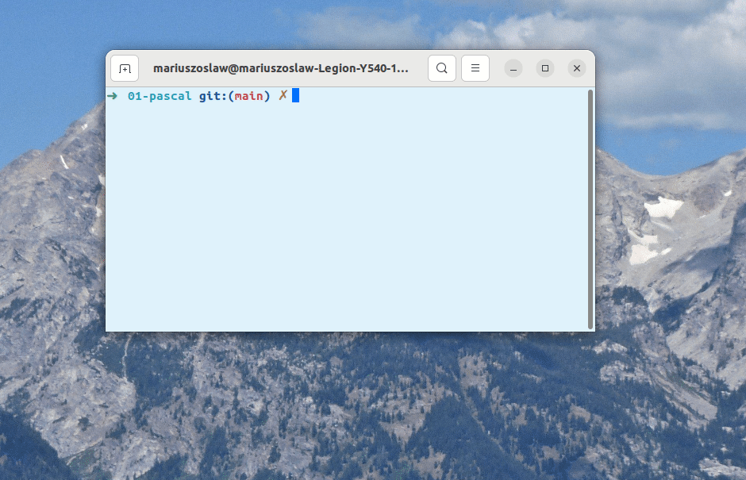

# Zadanie 1

# Pascal

# ✅ 3.0 Procedura do generowania 50 losowych liczb od 0 do 100

# ✅ 3.5 Procedura do sortowania liczb

(użycie High oraz Low w funkcji sortującej)[https://www.freepascal.org/docs-html/rtl/system/high.html]

# ✅4.0 Dodanie parametrów do procedury losującej określającymi zakres losowania: od, do, ile

